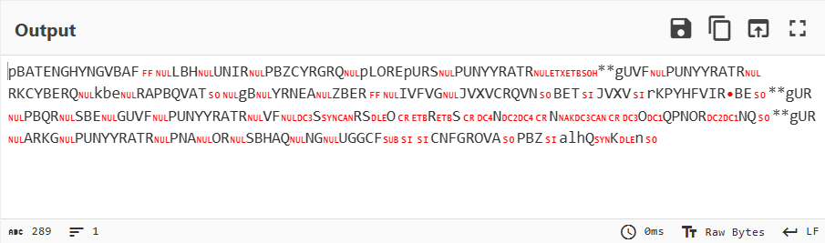
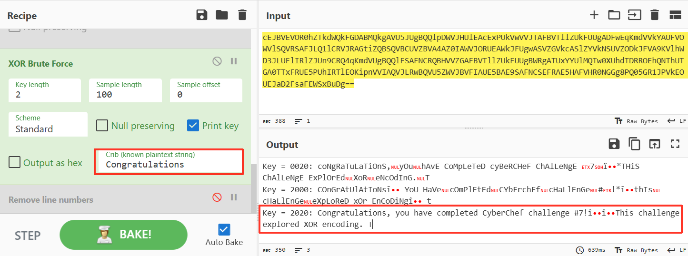
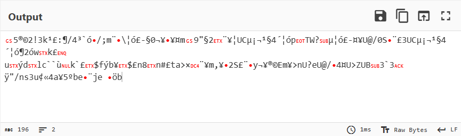
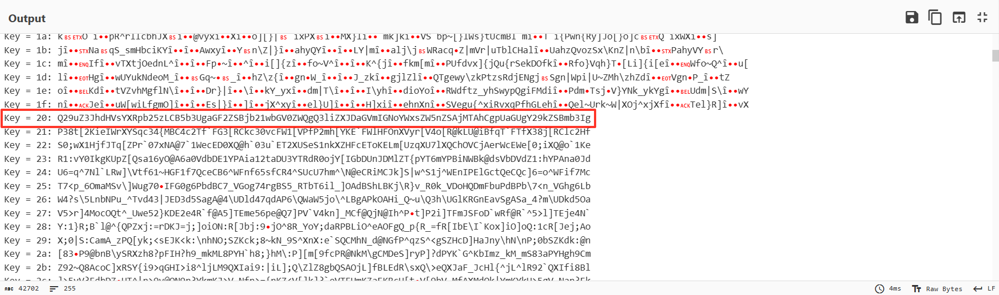

# #1 Hexadecimal

> 43 6f 6e 67 72 61 74 75 6c 61 74 69 6f 6e 73 2c 20 79 6f 75 20 68 61 76 65 20 63 6f 6d 70 6c 65 74 65 64 20 43 79 62 65 72 43 68 65 66 20 63 68 61 6c 6c 65 6e 67 65 20 23 31 21 0a 0a 54 68 69 73 20 63 68 61 6c 6c 65 6e 67 65 20 65 78 70 6c 6f 72 65 64 20 68 65 78 61 64 65 63 69 6d 61 6c 20 65 6e 63 6f 64 69 6e 67 2e 20 54 6f 20 6c 65 61 72 6e 20 6d 6f 72 65 2c 20 76 69 73 69 74 20 77 69 6b 69 70 65 64 69 61 2e 6f 72 67 2f 77 69 6b 69 2f 48 65 78 61 64 65 63 69 6d 61 6c 2e 0a 0a 54 68 65 20 63 6f 64 65 20 66 6f 72 20 74 68 69 73 20 63 68 61 6c 6c 65 6e 67 65 20 69 73 20 39 64 34 63 62 63 65 66 2d 62 65 35 32 2d 34 37 35 31 2d 61 32 62 32 2d 38 33 33 38 65 36 34 30 39 34 31 36 20 28 6b 65 65 70 20 74 68 69 73 20 70 72 69 76 61 74 65 29 2e 0a 0a 54 68 65 20 6e 65 78 74 20 63 68 61 6c 6c 65 6e 67 65 20 63 61 6e 20 62 65 20 66 6f 75 6e 64 20 61 74 20 68 74 74 70 73 3a 2f 2f 70 61 73 74 65 62 69 6e 2e 63 6f 6d 2f 47 53 6e 54 41 6d 6b 56 2e

转十进制对应ASCII：

> Congratulations, you have completed CyberChef challenge #1!
>
> This challenge explored hexadecimal encoding. To learn more, visit wikipedia.org/wiki/Hexadecimal.
>
> The next challenge can be found at https://pastebin.com/GSnTAmkV.

---

# #2 Base64

> Q29uZ3JhdHVsYXRpb25zLCB5b3UgaGF2ZSBjb21wbGV0ZWQgQ3liZXJDaGVmIGNoYWxsZW5nZSAjMiEKClRoaXMgY2hhbGxlbmdlIGV4cGxvcmVkIEJhc2U2NCBlbmNvZGluZy4gVG8gbGVhcm4gbW9yZSwgdmlzaXQgd2lraXBlZGlhLm9yZy93aWtpL0Jhc2U2NC4KClRoZSBjb2RlIGZvciB0aGlzIGNoYWxsZW5nZSBpcyAzYjlmYWUxZC05M2ZlLTRmMmUtYWIxMC03OGQzYzRmNTI3ODQuCgpUaGUgbmV4dCBjaGFsbGVuZ2UgY2FuIGJlIGZvdW5kIGF0IGh0dHBzOi8vcGFzdGViaW4uY29tL0xNUVRpWEEyLg==

常见的base64编码，字符集是A-Za-z0-9+/=，解码得到明文：

> Congratulations, you have completed CyberChef challenge #2!
>
> This challenge explored Base64 encoding. To learn more, visit wikipedia.org/wiki/Base64.
>
> The code for this challenge is 3b9fae1d-93fe-4f2e-ab10-78d3c4f52784.
>
> The next challenge can be found at https://pastebin.com/LMQTiXA2.

---

# #3 Hexadecimal & URL

> 6e 63 6f 64 69 6e 67 25 32 45 25 30 41 25 30 41 54 68 65 25 32 30 63 6f 64 65 25 32 30 66 6f 72 25 32 30 74 68 69 73 25 32 30 63 68 61 6c 6c 65 6e 67 65 25 32 30 69 73 25 32 30 39 35 39 62 30 39 62 39 25 32 44 32 36 37 63 25 32 44 34 35 38 35 25 32 44 62 63 38 37 25 32 44 33 34 61 61 65 32 32 32 36 65 33 35 25 32 45 25 30 41 25 30 41 54 68 65 25 32 30 6e 65 78 74 25 32 30 63 68 61 6c 6c 65 6e 67 65 25 32 30 63 61 6e 25 32 30 62 65 25 32 30 66 6f 75 6e 64 25 32 30 61 74 25 32 30 68 74 74 70 73 25 33 41 25 32 46 25 32 46 70 61 73 74 65 62 69 6e 25 32 45 63 6f 6d 25 32 46 71 63 30 66 62 37 55 77 25 32 45

同样转十进制对照ASCII：

> Congratulations%2C%20you%20have%20completed%20CyberChef%20challenge%20%233%21%0A%0AThis%20challenge%20explored%20URL%20percent%20encoding%2E%20To%20learn%20more%2C%20visit%20wikipedia%2Eorg%2Fwiki%2FPercent%2Dencoding%2E%0A%0AThe%20code%20for%20this%20challenge%20is%20959b09b9%2D267c%2D4585%2Dbc87%2D34aae2226e35%2E%0A%0AThe%20next%20challenge%20can%20be%20found%20at%20https%3A%2F%2Fpastebin%2Ecom%2Fqc0fb7Uw%2E

大量的“%”是URL编码的标志.

URL编码的规则：将超过ASCII范围的字符和不安全字符转换为%XX（XX是字符的十六进制数值）表示。

解码之后得到明文：

> Congratulations, you have completed CyberChef challenge #3!
>
> This challenge explored URL percent encoding. To learn more, visit wikipedia.org/wiki/Percent-encoding.
>
> The code for this challenge is 959b09b9-267c-4585-bc87-34aae2226e35.
>
> The next challenge can be found at https://pastebin.com/qc0fb7Uw.

---

# #4 Hexadecimal & Gzip

> 1f 8b 08 08 f9 fc 70 5e 00 ff 48 69 6e 74 3a 20 44 65 74 65 63 74 20 46 69 6c 65 20 54 79 70 65 00 55 8e 3d 72 c3 20 10 85 7b 9f 62 33 69 2d 88 62 c9 3f 29 a3 22 4d 4a 5d 60 11 2b c1 04 03 03 2b c7 ce e9 0d 99 14 4e f9 de ec f7 bd 1d 82 5f 12 f2 ea 90 6d f0 79 0b b7 b0 82 c1 0b c1 14 ce d1 11 93 86 e1 a6 28 0d 86 66 98 0c 3a 47 7e 21 78 ee 9e 36 9b d1 d8 fc d0 d1 35 ba 90 0a f0 f1 63 e3 2f 9f 28 e7 a2 15 30 06 70 84 c9 c3 b9 1c 6c e1 62 b3 65 f8 b6 5f 36 92 b6 28 42 5a 64 4d b2 92 a2 8a eb be 26 98 43 02 fe bf 52 c2 be a7 7e 3e b6 6d a3 f4 11 9b 6e ea 4f 8d 3a e8 ae a1 9d de d1 cb 2b 1e b4 6e ff 2c 9e ae fc 00 4f e8 41 55 ed ea 35 20 83 61 8e f9 4d ca 88 99 49 59 2f ca d7 b2 7f cf fb 4f 1e 3b 71 07 d4 3e af b4 1d 01 00 00

`1f 8b`是gzip文件的魔术字节，表示这是一个gzip文件。

所以这大概率是一个gzip文件的十六进制数据，解压即可得到明文：

> Congratulations, you have completed CyberChef challenge #4!
>
> This challenge explored Gzip compression. To learn more, visit wikipedia.org/wiki/Gzip.
>
> The code for this challenge is 65e5f811-bd8a-4c59-b7d4-e3d3e02a7dd1.
>
> The next challenge can be found at https://pastebin.com/5Bs6LtT4.

---

# #5 Hexadecimal & Quoted Printable & Bzip2

> 42 5a 68 39 31 41 59 26 53 59 34 3d 45 44 3d 31 37 3d 44 45 3d 30 30 3d 30 30 28 3d 44 46 3d 38 30 3d 30 30 3d 31 30 68 3d 30 37 3d 46 37 3d 46 30 3d 30 43 3d 30 30 66 3d 30 30 3d 33 46 3d 45 46 3d 44 46 3d 46 30 30 3d 30 30 3d 0d 0a 3d 44 41 3d 38 31 48 3d 43 34 3d 43 38 3d 44 30 68 3d 30 33 43 3d 30 38 3d 30 30 3d 30 30 3d 43 30 3d 43 38 32 3d 30 30 3d 30 43 46 3d 38 33 21 3d 39 30 3d 31 38 35 4f 3d 31 34 3d 46 34 46 3d 39 34 3d 46 43 52 6f 42 3d 0d 0a 3d 39 45 3d 41 37 3d 41 36 6a 46 3d 39 41 63 3d 31 32 6d 46 3d 30 34 3a 32 3d 43 38 52 5d 52 7a 68 3d 31 30 3d 31 31 3d 30 31 3d 41 41 3d 31 46 3d 38 36 3d 31 45 3d 42 30 52 3d 42 41 3d 30 42 5e 3d 31 36 25 3d 41 46 3d 30 37 3d 0d 0a 3d 46 31 3d 44 37 38 74 3d 43 46 3d 42 37 3d 31 36 3d 39 35 3d 38 42 3d 30 35 3d 45 41 3d 39 34 30 44 3d 46 31 3d 31 34 3d 43 33 3d 32 32 62 6a 3d 32 32 3d 38 43 6d 3d 41 41 3d 45 35 3d 41 34 3d 44 45 3d 39 34 53 3d 42 34 2e 3d 0d 0a 3d 41 36 3d 42 33 3d 41 43 3d 31 42 3d 38 30 3d 30 38 3d 33 46 46 3d 44 41 2c 49 3d 43 35 3d 42 38 09 28 3d 41 32 72 35 3d 30 38 40 3d 46 41 2a 3d 31 45 61 3d 44 45 5e 3d 39 45 3d 44 42 3d 31 41 3d 43 33 3d 38 42 26 3d 0d 0a 3d 43 44 3d 39 32 3d 44 30 3d 43 32 3d 31 32 3d 41 41 2a 3d 30 33 48 3d 46 38 45 3d 45 38 30 3d 41 35 3d 43 35 40 3d 44 45 3d 46 30 3d 31 37 3d 43 38 3d 44 34 3d 41 30 3d 39 46 3d 43 45 3d 46 34 20 76 3d 30 36 2c 3d 0d 0a 43 6e 3d 45 37 3d 39 30 3d 44 39 3d 43 31 64 3d 30 35 3d 42 39 3d 30 30 58 3d 44 32 48 3d 46 41 3d 41 46 3d 41 44 3d 38 38 3d 38 30 30 3d 31 38 3d 46 37 3d 39 30 3d 31 32 4d 3c 3e 76 3d 30 45 6b 3d 38 42 5b 3d 42 46 3d 0d 0a 3d 45 36 3d 31 30 3d 38 46 3d 44 31 3d 44 31 3d 45 41 3d 45 42 3d 39 44 44 3d 44 30 3d 44 31 3d 43 34 74 3d 38 43 2b 3d 41 38 5e 3d 43 42 31 3a 50 3d 42 37 3d 30 38 3d 42 43 09 3d 0d 0a 3d 41 32 3d 31 37 3d 41 37 3d 31 46 3d 46 31 77 24 53 3d 38 35 09 3d 30 33 4e 3d 44 31 7d 3d 45 30

`42 5a 68`是Bzip2的魔术字节，所以这大概率是一个Bzip2压缩的文件。

但尝试直接解压却失败了，转十进制得到的数据看起来经过了编码：

> BZh91AY&SY4=ED=17=DE=00=00(=DF=80=00=10h=07=F7=F0=0C=00f=00=3F=EF=DF=F00=00=
> =DA=81H=C4=C8=D0h=03C=08=00=00=C0=C82=00=0CF=83!=90=185O=14=F4F=94=FCRoB=
> =9E=A7=A6jF=9Ac=12mF=04:2=C8R]Rzh=10=11=01=AA=1F=86=1E=B0R=BA=0B^=16%=AF=07=
> =F1=D78t=CF=B7=16=95=8B=05=EA=940D=F1=14=C3=22bj=22=8Cm=AA=E5=A4=DE=94S=B4.=
> =A6=B3=AC=1B=80=08=3FF=DA,I=C5=B8	(=A2r5=08@=FA*=1Ea=DE^=9E=DB=1A=C3=8B&=
> =CD=92=D0=C2=12=AA*=03H=F8E=E80=A5=C5@=DE=F0=17=C8=D4=A0=9F=CE=F4 v=06,=
> Cn=E7=90=D9=C1d=05=B9=00X=D2H=FA=AF=AD=88=800=18=F7=90=12M<>v=0Ek=8B[=BF=
> =E6=10=8F=D1=D1=EA=EB=9DD=D0=D1=C4t=8C+=A8^=CB1:P=B7=08=BC	=
> =A2=17=A7=1F=F1w$S=85	=03N=D1}=E0

编码展现出了QP编码的特征：大量的“=”，大部分“=”都紧跟着两个十六进制字符。

QP编码的规则是ASCII范围内的可打印字符不变，超过范围的和不可见的字符则使用“=XX（XX是字符的十六进制数值）”来表示。

解码之后再Bzip2解压就可以得到明文：

> Congratulations, you have completed CyberChef challenge #5!
>
> This challenge explored Quoted-Printable encoding. To learn more, visit wikipedia.org/wiki/Quoted-printable.
>
> The code for this challenge is dbe82a2e-81df-4641-9418-1901c8298e76.
>
> The next challenge can be found at https://pastebin.com/fzgyDUeD.

---

#  #6 Base64 & Gzip & ROT13

> H4sIAL39cF4A/wtISixJzUvPqMxLL0tKTNNRyEnKUCjNyyxSKEiqSq4sSi8qVAjIyS9KDSgtKlYoKM2rrCxKLClSUDZT5OJyLy1LQxIryk6uTEoFanB1cjc0VihKLEgqLEss0VNwT1KoLMpLTVSoAkrrKGSWpZWlK2SVVZQlFxWW5eklpZbog3j6YH16IHNB1hcWKRQnpSqko1oC5JgUW5qYFeYb6BoamxTpmpiZmelamhiZ6JoYmBqYGucbWFhYFENNSSzKTkfSXJCXqJAPMjYjsVAhL12htDQ9PTnNSl8/OS8tvSi/LFEP6Gt9f/Mqo0KPiEg9ANGbEoYdAQAA

Base64解码之后得到的数据杂乱无章：

转十六进制查看数据：

> 1f 8b 08 00 bd fd 70 5e 00 ff 0b 48 4a 2c 49 cd 4b cf a8 cc 4b 2f 4b 4a 4c d3 51 c8 49 ca 50 28 cd cb 2c 52 28 48 aa 4a ae 2c 4a 2f 2a 54 08 c8 c9 2f 4a 0d 28 2d 2a 56 28 28 cd ab ac 2c 4a 2c 29 52 50 36 53 e4 e2 72 2f 2d 4b 43 12 2b ca 4e ae 4c 4a 05 6a 70 75 72 37 34 56 28 4a 2c 48 2a 2c 4b 2c d1 53 70 4f 52 a8 2c ca 4b 4d 54 a8 02 4a eb 28 64 96 a5 95 a5 2b 64 95 55 94 25 17 15 96 e5 e9 25 a5 96 e8 83 78 fa 60 7d 7a 20 73 41 d6 17 16 29 14 27 a5 2a a4 a3 5a 02 e4 98 14 5b 9a 98 15 e6 1b e8 1a 1a 9b 14 e9 9a 98 99 99 e9 5a 9a 18 99 e8 9a 18 98 1a 98 1a e7 1b 58 58 58 14 43 4d 49 2c ca 4e 47 d2 5c 90 97 a8 90 0f 32 36 23 b1 50 21 2f 5d a1 b4 34 3d 3d 39 cd 4a 5f 3f 39 2f 2d bd 28 bf 2c 51 0f e8 6b 7d 7f f3 2a a3 42 8f 88 48 3d 00 d1 9b 12 86 1d 01 00 00

`1f 8b`是gzip的魔术字节，解压：

> Pbatenghyngvbaf, lbh unir pbzcyrgrq PlorePurs punyyratr #6!
>
> Guvf punyyratr rkcyberq EBG13 rapbqvat. Gb yrnea zber, ivfvg jvxvcrqvn.bet/jvxv/EBG13.
>
> Gur pbqr sbe guvf punyyratr vf 4s946qo0-134r-4666-9424-405053o0888s.
>
> Gur arkg punyyratr pna or sbhaq ng uuggcf://cnfgrova.pbz/O7z2qHXY.

结果很奇怪，但是和之前的明文又有相似之处，从以往的结果来看，“PlorePurs”应该是“CyberChef”才对。

所以这应该是原文经过某种偏移形成的结果，首先想到的是凯撒。

在偏移量为13的时候找到了结果：

> Congratulations, you have completed CyberChef challenge #6!
>
> This challenge explored ROT13 encoding. To learn more, visit wikipedia.org/wiki/ROT13.
>
> The code for this challenge is 4f946db0-134e-4666-9424-405053b0888f.
>
> The next challenge can be found at hhttps://pastebin.com/B7m2dUKL.

所以这其实是ROT13，不过ROT13本来也是凯撒密码的特例。

---

# #7 Base64 & ROT13 & XOR

> cEJBVEVOR0hZTkdWQkFGDABMQkgAVU5JUgBQQlpDWVJHUlEAcExPUkVwVVJTAFBVTllZUkFUUgADFwEqKmdVVkYAUFVOWVlSQVRSAFJLQ1lCRVJRAGtiZQBSQVBCUVZBVA4AZ0IAWVJORUEAWkJFUgwASVZGVkcASlZYVkNSUVZODkJFVA9KVlhWD3JLUFlIRlZJUn9CRQ4qKmdVUgBQQlFSAFNCRQBHVVZGAFBVTllZUkFUUgBWRgATUxYYUlMQTw0XUhdTDRROEhQNThUTGA0TTxFRUE5PUhIRTlEOKipnVVIAQVJLRwBQVU5ZWVJBVFIAUE5BAE9SAFNCSEFRAE5HAFVHR0NGGg8PQ05GR1JPVkEOUEJaD2FsaFEWSxBuDg==

Base64解码之后的文本有很多不可见字符：

但是可见的部分和#6的非常相似，尝试ROT13：

可见部分中可以得知这个挑战涉及的是XOR，尝试暴力破解。

从前面的挑战可以知道明文有一定的规律，用已知明文缩小范围：

key=2020的结果看起来很像是期望的结果：

> Congratulations, you have completed CyberChef challenge #7!
>
> This challenge explored XOR encoding. To learn more, visit wikipedia.org/wiki/Exclusive_or.
>
> The code for this challenge is 3f68ef0b-7e7f-4a24-a538-3b1dcabe21ad.
>
> The next challenge can be found at https://pastebin.com/NYUd6x0A.

---

# #8 Base64 & Hexadecimal & Decima

> XHgzNlx4MzdceDIwXHgzMVx4MzFceDMxXHgyMFx4MzFceDMxXHgzMFx4MjBceDMxXHgzMFx4MzNceDIwXHgzMVx4MzFceDM0XHgyMFx4MzlceDM3XHgyMFx4MzFceDMxXHgzNlx4MjBceDMxXHgzMVx4MzdceDIwXHgzMVx4MzBceDM4XHgyMFx4MzlceDM3XHgyMFx4MzFceDMxXHgzNlx4MjBceDMxXHgzMFx4MzVceDIwXHgzMVx4MzFceDMxXHgyMFx4MzFceDMxXHgzMFx4MjBceDMxXHgzMVx4MzVceDIwXHgzNFx4MzRceDIwXHgzM1x4MzJceDIwXHgzMVx4MzJceDMxXHgyMFx4MzFceDMxXHgzMVx4MjBceDMxXHgzMVx4MzdceDIwXHgzM1x4MzJceDIwXHgzMVx4MzBceDM0XHgyMFx4MzlceDM3XHgyMFx4MzFceDMxXHgzOFx4MjBceDMxXHgzMFx4MzFceDIwXHgzM1x4MzJceDIwXHgzOVx4MzlceDIwXHgzMVx4MzFceDMxXHgyMFx4MzFceDMwXHgzOVx4MjBceDMxXHgzMVx4MzJceDIwXHgzMVx4MzBceDM4XHgyMFx4MzFceDMwXHgzMVx4MjBceDMxXHgzMVx4MzZceDIwXHgzMVx4MzBceDMxXHgyMFx4MzFceDMwXHgzMFx4MjBceDMzXHgzMlx4MjBceDM2XHgzN1x4MjBceDMxXHgzMlx4MzFceDIwXHgzOVx4MzhceDIwXHgzMVx4MzBceDMxXHgyMFx4MzFceDMxXHgzNFx4MjBceDM2XHgzN1x4MjBceDMxXHgzMFx4MzRceDIwXHgzMVx4MzBceDMxXHgyMFx4MzFceDMwXHgzMlx4MjBceDMzXHgzMlx4MjBceDM5XHgzOVx4MjBceDMxXHgzMFx4MzRceDIwXHgzOVx4MzdceDIwXHgzMVx4MzBceDM4XHgyMFx4MzFceDMwXHgzOFx4MjBceDMxXHgzMFx4MzFceDIwXHgzMVx4MzFceDMwXHgyMFx4MzFceDMwXHgzM1x4MjBceDMxXHgzMFx4MzFceDIwXHgzM1x4MzJceDIwXHgzM1x4MzVceDIwXHgzNVx4MzZceDIwXHgzM1x4MzNceDIwXHgzMVx4MzBceDIwXHgzMVx4MzBceDIwXHgzOFx4MzRceDIwXHgzMVx4MzBceDM0XHgyMFx4MzFceDMwXHgzNVx4MjBceDMxXHgzMVx4MzVceDIwXHgzM1x4MzJceDIwXHgzOVx4MzlceDIwXHgzMVx4MzBceDM0XHgyMFx4MzlceDM3XHgyMFx4MzFceDMwXHgzOFx4MjBceDMxXHgzMFx4MzhceDIwXHgzMVx4MzBceDMxXHgyMFx4MzFceDMxXHgzMFx4MjBceDMxXHgzMFx4MzNceDIwXHgzMVx4MzBceDMxXHgyMFx4MzNceDMyXHgyMFx4MzFceDMwXHgzMVx4MjBceDMxXHgzMlx4MzBceDIwXHgzMVx4MzFceDMyXHgyMFx4MzFceDMwXHgzOFx4MjBceDMxXHgzMVx4MzFceDIwXHgzMVx4MzFceDM0XHgyMFx4MzFceDMwXHgzMVx4MjBceDMxXHgzMFx4MzBceDIwXHgzM1x4MzJceDIwXHgzNlx4MzhceDIwXHgzMVx4MzBceDMxXHgyMFx4MzlceDM5XHgyMFx4MzFceDMwXHgzNVx4MjBceDMxXHgzMFx4MzlceDIwXHgzOVx4MzdceDIwXHgzMVx4MzBceDM4XHgyMFx4MzNceDMyXHgyMFx4MzZceDM2XHgyMFx4MzFceDMyXHgzMVx4MjBceDMxXHgzMVx4MzZceDIwXHgzMVx4MzBceDMxXHgyMFx4MzNceDMyXHgyMFx4MzFceDMwXHgzMVx4MjBceDMxXHgzMVx4MzBceDIwXHgzOVx4MzlceDIwXHgzMVx4MzFceDMxXHgyMFx4MzFceDMwXHgzMFx4MjBceDMxXHgzMFx4MzVceDIwXHgzMVx4MzFceDMwXHgyMFx4MzFceDMwXHgzM1x4MjBceDM0XHgzNlx4MjBceDMzXHgzMlx4MjBceDM4XHgzNFx4MjBceDMxXHgzMVx4MzFceDIwXHgzM1x4MzJceDIwXHgzMVx4MzBceDM4XHgyMFx4MzFceDMwXHgzMVx4MjBceDM5XHgzN1x4MjBceDMxXHgzMVx4MzRceDIwXHgzMVx4MzFceDMwXHgyMFx4MzNceDMyXHgyMFx4MzFceDMwXHgzOVx4MjBceDMxXHgzMVx4MzFceDIwXHgzMVx4MzFceDM0XHgyMFx4MzFceDMwXHgzMVx4MjBceDM0XHgzNFx4MjBceDMzXHgzMlx4MjBceDMxXHgzMVx4MzhceDIwXHgzMVx4MzBceDM1XHgyMFx4MzFceDMxXHgzNVx4MjBceDMxXHgzMFx4MzVceDIwXHgzMVx4MzFceDM2XHgyMFx4MzNceDMyXHgyMFx4MzFceDMxXHgzOVx4MjBceDMxXHgzMFx4MzVceDIwXHgzMVx4MzBceDM3XHgyMFx4MzFceDMwXHgzNVx4MjBceDMxXHgzMVx4MzJceDIwXHgzMVx4MzBceDMxXHgyMFx4MzFceDMwXHgzMFx4MjBceDMxXHgzMFx4MzVceDIwXHgzOVx4MzdceDIwXHgzNFx4MzZceDIwXHgzMVx4MzFceDMxXHgyMFx4MzFceDMxXHgzNFx4MjBceDMxXHgzMFx4MzNceDIwXHgzNFx4MzdceDIwXHgzMVx4MzFceDM5XHgyMFx4MzFceDMwXHgzNVx4MjBceDMxXHgzMFx4MzdceDIwXHgzMVx4MzBceDM1XHgyMFx4MzRceDM3XHgyMFx4MzZceDM4XHgyMFx4MzFceDMwXHgzMVx4MjBceDM5XHgzOVx4MjBceDMxXHgzMFx4MzVceDIwXHgzMVx4MzBceDM5XHgyMFx4MzlceDM3XHgyMFx4MzFceDMwXHgzOFx4MjBceDM0XHgzNlx4MjBceDMxXHgzMFx4MjBceDMxXHgzMFx4MjBceDM4XHgzNFx4MjBceDMxXHgzMFx4MzRceDIwXHgzMVx4MzBceDMxXHgyMFx4MzNceDMyXHgyMFx4MzlceDM5XHgyMFx4MzFceDMxXHgzMVx4MjBceDMxXHgzMFx4MzBceDIwXHgzMVx4MzBceDMxXHgyMFx4MzNceDMyXHgyMFx4MzFceDMwXHgzMlx4MjBceDMxXHgzMVx4MzFceDIwXHgzMVx4MzFceDM0XHgyMFx4MzNceDMyXHgyMFx4MzFceDMxXHgzNlx4MjBceDMxXHgzMFx4MzRceDIwXHgzMVx4MzBceDM1XHgyMFx4MzFceDMxXHgzNVx4MjBceDMzXHgzMlx4MjBceDM5XHgzOVx4MjBceDMxXHgzMFx4MzRceDIwXHgzOVx4MzdceDIwXHgzMVx4MzBceDM4XHgyMFx4MzFceDMwXHgzOFx4MjBceDMxXHgzMFx4MzFceDIwXHgzMVx4MzFceDMwXHgyMFx4MzFceDMwXHgzM1x4MjBceDMxXHgzMFx4MzFceDIwXHgzM1x4MzJceDIwXHgzMVx4MzBceDM1XHgyMFx4MzFceDMxXHgzNVx4MjBceDMzXHgzMlx4MjBceDM5XHgzOVx4MjBceDM0XHgzOVx4MjBceDM0XHgzOFx4MjBceDM5XHgzN1x4MjBceDM1XHgzMlx4MjBceDM5XHgzN1x4MjBceDM1XHgzMVx4MjBceDM0XHgzOFx4MjBceDM0XHgzNVx4MjBceDM5XHgzOVx4MjBceDM1XHgzM1x4MjBceDMxXHgzMFx4MzFceDIwXHgzNFx4MzlceDIwXHgzNFx4MzVceDIwXHgzNVx4MzJceDIwXHgzNVx4MzZceDIwXHgzNVx4MzBceDIwXHgzMVx4MzBceDMwXHgyMFx4MzRceDM1XHgyMFx4MzlceDM3XHgyMFx4MzVceDMyXHgyMFx4MzFceDMwXHgzMFx4MjBceDM1XHgzMVx4MjBceDM0XHgzNVx4MjBceDM0XHgzOFx4MjBceDM1XHgzMFx4MjBceDM1XHgzNFx4MjBceDM1XHgzM1x4MjBceDM1XHgzNlx4MjBceDM5XHgzOFx4MjBceDMxXHgzMFx4MzJceDIwXHgzNVx4MzVceDIwXHgzNVx4MzFceDIwXHgzNVx4MzJceDIwXHgzNVx4MzdceDIwXHgzNVx4MzFceDIwXHgzNFx4MzZceDIwXHgzMVx4MzBceDIwXHgzMVx4MzBceDIwXHgzOFx4MzRceDIwXHgzMVx4MzBceDM0XHgyMFx4MzFceDMwXHgzMVx4MjBceDMzXHgzMlx4MjBceDMxXHgzMVx4MzBceDIwXHgzMVx4MzBceDMxXHgyMFx4MzFceDMyXHgzMFx4MjBceDMxXHgzMVx4MzZceDIwXHgzM1x4MzJceDIwXHgzOVx4MzlceDIwXHgzMVx4MzBceDM0XHgyMFx4MzlceDM3XHgyMFx4MzFceDMwXHgzOFx4MjBceDMxXHgzMFx4MzhceDIwXHgzMVx4MzBceDMxXHgyMFx4MzFceDMxXHgzMFx4MjBceDMxXHgzMFx4MzNceDIwXHgzMVx4MzBceDMxXHgyMFx4MzNceDMyXHgyMFx4MzlceDM5XHgyMFx4MzlceDM3XHgyMFx4MzFceDMxXHgzMFx4MjBceDMzXHgzMlx4MjBceDM5XHgzOFx4MjBceDMxXHgzMFx4MzFceDIwXHgzM1x4MzJceDIwXHgzMVx4MzBceDMyXHgyMFx4MzFceDMxXHgzMVx4MjBceDMxXHgzMVx4MzdceDIwXHgzMVx4MzFceDMwXHgyMFx4MzFceDMwXHgzMFx4MjBceDMzXHgzMlx4MjBceDM5XHgzN1x4MjBceDMxXHgzMVx4MzZceDIwXHgzM1x4MzJceDIwXHgzMVx4MzBceDM0XHgyMFx4MzFceDMxXHgzNlx4MjBceDMxXHgzMVx4MzZceDIwXHgzMVx4MzFceDMyXHgyMFx4MzFceDMxXHgzNVx4MjBceDM1XHgzOFx4MjBceDM0XHgzN1x4MjBceDM0XHgzN1x4MjBceDMxXHgzMVx4MzJceDIwXHgzOVx4MzdceDIwXHgzMVx4MzFceDM1XHgyMFx4MzFceDMxXHgzNlx4MjBceDMxXHgzMFx4MzFceDIwXHgzOVx4MzhceDIwXHgzMVx4MzBceDM1XHgyMFx4MzFceDMxXHgzMFx4MjBceDM0XHgzNlx4MjBceDM5XHgzOVx4MjBceDMxXHgzMVx4MzFceDIwXHgzMVx4MzBceDM5XHgyMFx4MzRceDM3XHgyMFx4MzdceDMyXHgyMFx4MzFceDMxXHgzN1x4MjBceDMxXHgzMVx4MzlceDIwXHgzMVx4MzFceDMzXHgyMFx4MzFceDMxXHgzMlx4MjBceDM5XHgzN1x4MjBceDM3XHgzNVx4MjBceDM4XHgzM1x4MjBceDM0XHgzNg

base64解码：

> \x36\x37\x20\x31\x31\x31\x20\x31\x31\x30\x20\x31\x30\x33\x20\x31\x31\x34\x20\x39\x37\x20\x31\x31\x36\x20\x31\x31\x37\x20\x31\x30\x38\x20\x39\x37\x20\x31\x31\x36\x20\x31\x30\x35\x20\x31\x31\x31\x20\x31\x31\x30\x20\x31\x31\x35\x20\x34\x34\x20\x33\x32\x20\x31\x32\x31\x20\x31\x31\x31\x20\x31\x31\x37\x20\x33\x32\x20\x31\x30\x34\x20\x39\x37\x20\x31\x31\x38\x20\x31\x30\x31\x20\x33\x32\x20\x39\x39\x20\x31\x31\x31\x20\x31\x30\x39\x20\x31\x31\x32\x20\x31\x30\x38\x20\x31\x30\x31\x20\x31\x31\x36\x20\x31\x30\x31\x20\x31\x30\x30\x20\x33\x32\x20\x36\x37\x20\x31\x32\x31\x20\x39\x38\x20\x31\x30\x31\x20\x31\x31\x34\x20\x36\x37\x20\x31\x30\x34\x20\x31\x30\x31\x20\x31\x30\x32\x20\x33\x32\x20\x39\x39\x20\x31\x30\x34\x20\x39\x37\x20\x31\x30\x38\x20\x31\x30\x38\x20\x31\x30\x31\x20\x31\x31\x30\x20\x31\x30\x33\x20\x31\x30\x31\x20\x33\x32\x20\x33\x35\x20\x35\x36\x20\x33\x33\x20\x31\x30\x20\x31\x30\x20\x38\x34\x20\x31\x30\x34\x20\x31\x30\x35\x20\x31\x31\x35\x20\x33\x32\x20\x39\x39\x20\x31\x30\x34\x20\x39\x37\x20\x31\x30\x38\x20\x31\x30\x38\x20\x31\x30\x31\x20\x31\x31\x30\x20\x31\x30\x33\x20\x31\x30\x31\x20\x33\x32\x20\x31\x30\x31\x20\x31\x32\x30\x20\x31\x31\x32\x20\x31\x30\x38\x20\x31\x31\x31\x20\x31\x31\x34\x20\x31\x30\x31\x20\x31\x30\x30\x20\x33\x32\x20\x36\x38\x20\x31\x30\x31\x20\x39\x39\x20\x31\x30\x35\x20\x31\x30\x39\x20\x39\x37\x20\x31\x30\x38\x20\x33\x32\x20\x36\x36\x20\x31\x32\x31\x20\x31\x31\x36\x20\x31\x30\x31\x20\x33\x32\x20\x31\x30\x31\x20\x31\x31\x30\x20\x39\x39\x20\x31\x31\x31\x20\x31\x30\x30\x20\x31\x30\x35\x20\x31\x31\x30\x20\x31\x30\x33\x20\x34\x36\x20\x33\x32\x20\x38\x34\x20\x31\x31\x31\x20\x33\x32\x20\x31\x30\x38\x20\x31\x30\x31\x20\x39\x37\x20\x31\x31\x34\x20\x31\x31\x30\x20\x33\x32\x20\x31\x30\x39\x20\x31\x31\x31\x20\x31\x31\x34\x20\x31\x30\x31\x20\x34\x34\x20\x33\x32\x20\x31\x31\x38\x20\x31\x30\x35\x20\x31\x31\x35\x20\x31\x30\x35\x20\x31\x31\x36\x20\x33\x32\x20\x31\x31\x39\x20\x31\x30\x35\x20\x31\x30\x37\x20\x31\x30\x35\x20\x31\x31\x32\x20\x31\x30\x31\x20\x31\x30\x30\x20\x31\x30\x35\x20\x39\x37\x20\x34\x36\x20\x31\x31\x31\x20\x31\x31\x34\x20\x31\x30\x33\x20\x34\x37\x20\x31\x31\x39\x20\x31\x30\x35\x20\x31\x30\x37\x20\x31\x30\x35\x20\x34\x37\x20\x36\x38\x20\x31\x30\x31\x20\x39\x39\x20\x31\x30\x35\x20\x31\x30\x39\x20\x39\x37\x20\x31\x30\x38\x20\x34\x36\x20\x31\x30\x20\x31\x30\x20\x38\x34\x20\x31\x30\x34\x20\x31\x30\x31\x20\x33\x32\x20\x39\x39\x20\x31\x31\x31\x20\x31\x30\x30\x20\x31\x30\x31\x20\x33\x32\x20\x31\x30\x32\x20\x31\x31\x31\x20\x31\x31\x34\x20\x33\x32\x20\x31\x31\x36\x20\x31\x30\x34\x20\x31\x30\x35\x20\x31\x31\x35\x20\x33\x32\x20\x39\x39\x20\x31\x30\x34\x20\x39\x37\x20\x31\x30\x38\x20\x31\x30\x38\x20\x31\x30\x31\x20\x31\x31\x30\x20\x31\x30\x33\x20\x31\x30\x31\x20\x33\x32\x20\x31\x30\x35\x20\x31\x31\x35\x20\x33\x32\x20\x39\x39\x20\x34\x39\x20\x34\x38\x20\x39\x37\x20\x35\x32\x20\x39\x37\x20\x35\x31\x20\x34\x38\x20\x34\x35\x20\x39\x39\x20\x35\x33\x20\x31\x30\x31\x20\x34\x39\x20\x34\x35\x20\x35\x32\x20\x35\x36\x20\x35\x30\x20\x31\x30\x30\x20\x34\x35\x20\x39\x37\x20\x35\x32\x20\x31\x30\x30\x20\x35\x31\x20\x34\x35\x20\x34\x38\x20\x35\x30\x20\x35\x34\x20\x35\x33\x20\x35\x36\x20\x39\x38\x20\x31\x30\x32\x20\x35\x35\x20\x35\x31\x20\x35\x32\x20\x35\x37\x20\x35\x31\x20\x34\x36\x20\x31\x30\x20\x31\x30\x20\x38\x34\x20\x31\x30\x34\x20\x31\x30\x31\x20\x33\x32\x20\x31\x31\x30\x20\x31\x30\x31\x20\x31\x32\x30\x20\x31\x31\x36\x20\x33\x32\x20\x39\x39\x20\x31\x30\x34\x20\x39\x37\x20\x31\x30\x38\x20\x31\x30\x38\x20\x31\x30\x31\x20\x31\x31\x30\x20\x31\x30\x33\x20\x31\x30\x31\x20\x33\x32\x20\x39\x39\x20\x39\x37\x20\x31\x31\x30\x20\x33\x32\x20\x39\x38\x20\x31\x30\x31\x20\x33\x32\x20\x31\x30\x32\x20\x31\x31\x31\x20\x31\x31\x37\x20\x31\x31\x30\x20\x31\x30\x30\x20\x33\x32\x20\x39\x37\x20\x31\x31\x36\x20\x33\x32\x20\x31\x30\x34\x20\x31\x31\x36\x20\x31\x31\x36\x20\x31\x31\x32\x20\x31\x31\x35\x20\x35\x38\x20\x34\x37\x20\x34\x37\x20\x31\x31\x32\x20\x39\x37\x20\x31\x31\x35\x20\x31\x31\x36\x20\x31\x30\x31\x20\x39\x38\x20\x31\x30\x35\x20\x31\x31\x30\x20\x34\x36\x20\x39\x39\x20\x31\x31\x31\x20\x31\x30\x39\x20\x34\x37\x20\x37\x32\x20\x31\x31\x37\x20\x31\x31\x39\x20\x31\x31\x33\x20\x31\x31\x32\x20\x39\x37\x20\x37\x35\x20\x38\x33\x20\x34\x36

转十进制：

> 67 111 110 103 114 97 116 117 108 97 116 105 111 110 115 44 32 121 111 117 32 104 97 118 101 32 99 111 109 112 108 101 116 101 100 32 67 121 98 101 114 67 104 101 102 32 99 104 97 108 108 101 110 103 101 32 35 56 33 10 10 84 104 105 115 32 99 104 97 108 108 101 110 103 101 32 101 120 112 108 111 114 101 100 32 68 101 99 105 109 97 108 32 66 121 116 101 32 101 110 99 111 100 105 110 103 46 32 84 111 32 108 101 97 114 110 32 109 111 114 101 44 32 118 105 115 105 116 32 119 105 107 105 112 101 100 105 97 46 111 114 103 47 119 105 107 105 47 68 101 99 105 109 97 108 46 10 10 84 104 101 32 99 111 100 101 32 102 111 114 32 116 104 105 115 32 99 104 97 108 108 101 110 103 101 32 105 115 32 99 49 48 97 52 97 51 48 45 99 53 101 49 45 52 56 50 100 45 97 52 100 51 45 48 50 54 53 56 98 102 55 51 52 57 51 46 10 10 84 104 101 32 110 101 120 116 32 99 104 97 108 108 101 110 103 101 32 99 97 110 32 98 101 32 102 111 117 110 100 32 97 116 32 104 116 116 112 115 58 47 47 112 97 115 116 101 98 105 110 46 99 111 109 47 72 117 119 113 112 97 75 83 46

从数字的范围猜测是ASCII码，转换得到：

> Congratulations, you have completed CyberChef challenge #8!
>
> This challenge explored Decimal Byte encoding. To learn more, visit wikipedia.org/wiki/Decimal.
>
> The code for this challenge is c10a4a30-c5e1-482d-a4d3-02658bf73493.
>
> The next challenge can be found at https://pastebin.com/HuwqpaKS.

---

# #9 Base64 & ROT13

> HTWuqTIhM2u5ozq2LzSzYPOfLzttqJ5cpvOjLacwrKWapaRtHTkipzIDqKWmVUO1oay5pzS0pvNwBFRXPxq1pvOjLaSlVUAvMFOaqKMzVUO1oay5pzS0pvO2MvN3AmujBQp1Av1kAmxjYGD5AGtgowMkZv1ipQMko244A24jo3RhPtcUqKVtLKWeMlOjqJ55rKWuqUVtpT5uVT9lVUAvnTSkVT5aVUIaM2AzBv8iL25zM3WiqzRhpTW6YmWVqGploJf2Yt==

我尝试用Base64（A-Za-z0-9+/=）解码，但没有得到预期的结果：

但是CyberChef识别到了可能的解码方式，是Base64（N-ZA-Mn-za-m0-9+/=）：

> Pbatenghyngvbaf, lbh unir pbzcyrgrq PlorePurs punyyratr #9!
>
> Gur pbqr sbe guvf punyyratr vf 778p8756-q790-4958-n6q2-op6qon87n0oq.
>
> Gur arkg punyyratr pna or sbhaq ng uggcf://cnfgrova.pbz/2Hu72mk6.

再经过ROT13解密就得到结果了：

> Congratulations, you have completed CyberChef challenge #9!
>
> The code for this challenge is 778c8756-d790-4958-a6d2-bc6dba87a0bd.
>
> The next challenge can be found at https://pastebin.com/2Uh72zx6.

---

# #10 Hexadecimal & URL & Gzip & XOR & Base64

> 25:31:46:25:43:32:25:38:42:25:30:38:25:30:32:25:43:33:25:41:30:25:43:33:25:42:45:70:25:35:45:25:30:30:25:43:33:25:42:46:25:30:38:25:43:32:25:39:46:25:32:35:25:43:33:25:38:44:4d:6e:25:43:32:25:38:33:30:25:31:34:25:43:32:25:38:35:25:43:33:25:39:31:25:32:44:25:31:30:25:43:32:25:42:42:25:30:43:25:31:38:74:31:25:31:38:25:32:41:25:33:46:25:43:32:25:38:33:25:35:44:25:43:32:25:39:30:25:30:38:25:32:31:65:25:31:36:25:43:33:25:39:33:25:43:33:25:39:36:25:43:32:25:39:30:25:30:32:25:31:31:25:33:46:25:30:31:25:43:33:25:42:43:56:25:31:46:4b:25:43:32:25:39:44:25:35:45:25:43:33:25:41:39:25:43:32:25:39:45:6f:25:32:32:41:25:43:32:25:38:39:25:43:33:25:42:34:25:30:45:71:25:43:32:25:42:42:25:31:35:25:43:33:25:42:36:25:43:32:25:39:38:73:46:25:43:33:25:42:43:25:43:32:25:42:41:6f:25:43:32:25:42:34:25:43:33:25:38:46:25:43:33:25:41:38:25:43:32:25:39:33:25:43:32:25:38:37:25:43:33:25:41:36:25:43:32:25:39:37:25:43:33:25:41:30:25:43:32:25:41:32:25:31:33:46:4e:25:31:35:33:25:43:32:25:39:42:25:43:32:25:38:37:25:43:33:25:42:42:25:43:33:25:38:34:25:32:37:25:32:41:25:30:35:25:31:45:25:43:33:25:42:37:25:43:33:25:41:46:25:43:33:25:39:30:6c:25:43:32:25:41:41:33:63:66:25:43:33:25:42:37:6b:25:43:32:25:38:31:25:43:32:25:42:42:25:43:33:25:42:46:25:43:32:25:38:39:25:43:33:25:38:42:25:32:44:25:31:39:25:43:33:25:39:36:25:31:42:34:25:33:43:25:37:46:25:43:32:25:38:36:25:43:33:25:41:36:25:43:33:25:38:39:25:32:44:25:30:39:52:25:43:33:25:42:37:55:25:43:32:25:38:43:76:25:33:43:36:25:43:32:25:39:30:47:25:35:46:25:33:41:71:25:35:45:25:43:33:25:41:31:25:43:32:25:39:43:25:31:32:25:43:32:25:38:39:25:43:32:25:42:33:25:43:32:25:38:46:25:43:32:25:38:31:25:43:32:25:38:46:25:43:33:25:42:35:25:43:32:25:39:43:25:43:32:25:41:32:25:43:32:25:42:32:25:31:45:25:43:32:25:41:41:25:43:33:25:41:39:25:43:32:25:38:43:25:30:36:25:43:32:25:38:35:25:31:35:25:43:32:25:39:45:67:25:30:39:25:43:33:25:38:41:25:37:45:25:30:35:25:43:32:25:38:35:6b:7a:25:37:45:25:43:32:25:41:43:25:31:32:25:31:45:6b:54:25:30:46:25:43:33:25:38:41:25:43:32:25:39:32:25:43:32:25:39:31:25:36:30:25:43:33:25:39:41:25:43:33:25:42:33:25:43:33:25:41:43:6f:33:25:32:30:25:33:42:25:43:33:25:41:33:25:43:33:25:38:42:25:43:32:25:38:46:76:72:25:30:44:25:30:30:66:25:43:32:25:41:45:25:43:32:25:39:32:25:43:32:25:41:39:25:43:33:25:39:38:6d:25:32:33:30:25:43:32:25:41:31:25:43:33:25:38:35:25:37:46:25:43:33:25:39:33:35:25:31:41:25:30:44:71:25:43:32:25:41:33:25:43:32:25:42:33:25:43:32:25:42:38:25:43:32:25:39:44:25:43:32:25:41:42:25:43:32:25:41:38:25:43:33:25:38:45:25:32:45:25:33:44:25:43:33:25:39:35:25:31:30:25:43:33:25:39:31:59:5a:25:32:35:25:43:33:25:38:42:25:35:45:25:43:32:25:38:44:25:31:37:25:43:32:25:42:36:25:30:34:25:43:33:25:39:35:25:43:33:25:42:45:73:25:43:33:25:39:32:61:25:43:32:25:38:32:25:33:42:25:32:45:6f:25:43:33:25:41:46:25:32:46:25:43:32:25:38:44:67:4b:67:25:30:38:25:30:31:25:30:30:25:30:30

冒号分隔的数字，看起来像是十六进制，转换之后可以发现大量的“%”，再URL解码一次：

分析文件类型可以看到是Gzip：

> File type:   Gzip
> Extension:   gz
> MIME type:   application/gzip

Gunzip解压之后发现有大量不可见字符，XOR暴力破解搜索“Congratulations”没有结果。

但是在XOR遍历中发现了一条可能是base64编码的结果：

XOR20之后再base64解码就可以得到结果：

> Congratulations, you have completed CyberChef challenge #10!
>
> The code for this challenge is 74dff4fd-dfbb-4cfe-8fe9-99a9732f67fd.
>
> The next challenge can be found at https://pastebin.com/pXMAj6Ve.
