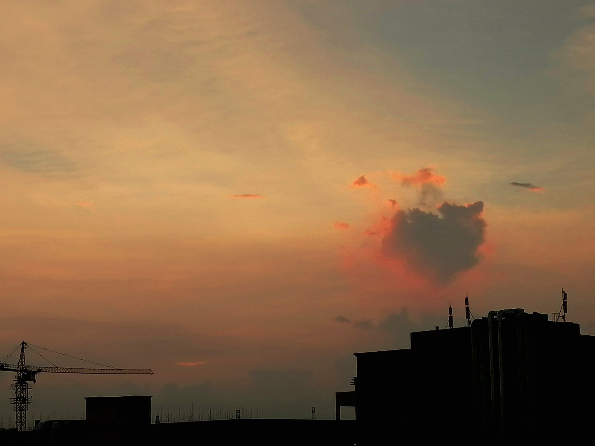

封面图片：《[kawaii on off](https://static.wixstatic.com/media/7ac599_6ebb3c248d0b4e0182d2150dab682bfd~mv2.gif)》&emsp;|&emsp;作者：アボガド6 (Avogado6)

---

只是一些零碎的思绪。

 

# 关于云

初三那年，我从同学的手里借了一本小说——《云边有个小卖部》。

那是我读的第一本张嘉佳的小说。有些人觉得张嘉佳的文字很矫情，很有些无病呻吟，又或者有些其他的看法。

不过我觉得对于作品的解读，本来就是各有各的看法。所谓“有一千个读者，就有一千个哈姆雷特”，不同的人有不同的感受是很正常的吧？

无论如何，我觉得我是很喜欢张嘉佳的文字的。

《云边有个小卖部》我看了很多遍，每一次都忍不住落泪。

> 有朵盛开的云，缓缓滑过山顶，随风飘向天边，我们慢慢明白，有些告别，就是最后一面。

这是书中让我感触颇深的文字之一。这之后的许多次，当我再看见云，我总是会有些莫名的感受。

> 一朵云缓缓滑过天边，我想我和它再也不会再见。

有一次在傍晚的天空下，我看见一朵云在缓缓的飘动。那是很大很白的一块云，飘得很慢很慢，给我一种宁静的感受。我看着它安静的飘荡，最后离开了我能看见的天空，随后我就想到了上面这句话。

此后很多次，看见云的时候，都会想起上面这句话。

 

后来有一天，我和爸爸出门去营业厅办理业务，回来的时候因为信息变动，我的电话卡短时间内不能通信。

我坐在后座上，抬起头来，看见夏日晴天。

白云身后的天空湛蓝，扁平的云像是涂抹的色彩，厚大的云像是点缀的装饰。

风拂过我的耳边，云也飘得那样慢。好像一切都不用着急，好像一切都有转机。

许久之前我得知，轻盈的云其实是无数细小的水滴。

然后在这一刻，我突然想到这么一段话：

> 循环不息的水
>
> 会不会我见到的某一朵云
>
> 其实是我久别的泪

